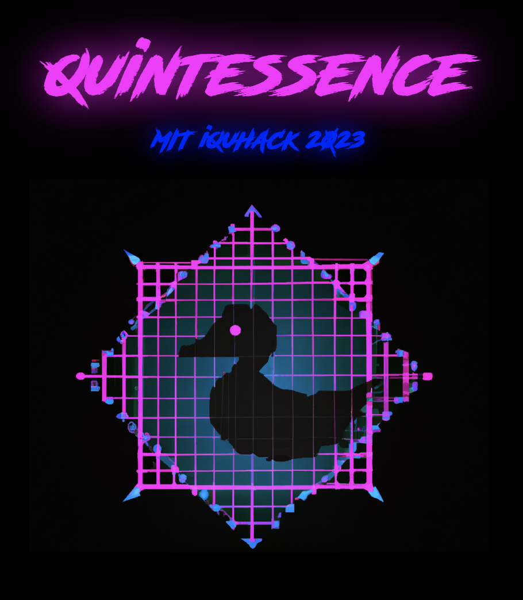

# Quintessence

MIT IQuHack 2023 Hackathon

## IonQ challenge

Landing page: <https://ionq.com/>

To recap, for this challenge, you must use a quantum computer to *generate* something new.
Some ideas:

- Make music with a quantum computer (<https://arxiv.org/pdf/2110.12408.pdf>)
- Render graphics with a quantum ray tracer (<https://arxiv.org/pdf/2204.12797.pdf>)
- Use procedural generation to make a new world (<https://arxiv.org/abs/2007.11510>)
- Make a QGAN (<https://arxiv.org/abs/2012.03924>)
Once you've debugged your code with regular simulation, please try our noisy simulators before graduating to hardware (if you have time). Hardware noise can have unexpected effects!
We will judge your entry based on both (1) how quantum it is and (2) how cool it is.

## Quantum haze

We are using a number preserving [quantum walk search algorithm](https://qiskit.org/textbook/ch-algorithms/quantum-walk-search-algorithm.html) running on IonQ to output results of a graph traversal algorithm which represents the drunken journey of our main character and how he tries to figure out what happened to him the previous night.
This output will be fed back into a transformers AI model and then to a stable diffusion AI model to generate a exciting dynamic storyline with associated graphics.

## Team members

- Victor Drouin-Touchette | vdrouin@physics.rutgers.edu
- Chris Lamb | cdl92@physics.rutgers.edu
- Philippe Cochin | philippe.cochin@gmail.com
- Gavin Rockwood | gavin.rockwood@physics.rutgers.edu
- Rob Davis | rpd89@physics.rutgers.edu
