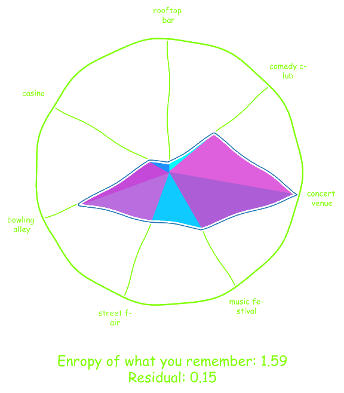

# Quintessence


MIT IQuHack 2023 Hackathon

## IonQ challenge

Landing page: <https://ionq.com/>

To recap, for this challenge, you must use a quantum computer to *generate* something new.
Some ideas:

- Make music with a quantum computer (<https://arxiv.org/pdf/2110.12408.pdf>)
- Render graphics with a quantum ray tracer (<https://arxiv.org/pdf/2204.12797.pdf>)
- Use procedural generation to make a new world (<https://arxiv.org/abs/2007.11510>)
- Make a QGAN (<https://arxiv.org/abs/2012.03924>)
Once you've debugged your code with regular simulation, please try our noisy simulators before graduating to hardware (if you have time). Hardware noise can have unexpected effects!
We will judge your entry based on both (1) how quantum it is and (2) how cool it is.

## Quantum haze

We are using a number preserving [quantum walk search algorithm](https://qiskit.org/textbook/ch-algorithms/quantum-walk-search-algorithm.html) running on IonQ (other backends can be included) to output results of a graph traversal algorithm which represents the scattered journey of our main character, Mr. Quanta, and how he tries to figure out what happened to him during his incoherent rambling through QuantaLand.
This output will be fed back into a transformers AI model and then to a stable diffusion AI model to generate a exciting dynamic storyline with associated graphics.
For a more in depth discussion of the applied circuit, see the following [file](./haze-frontend/public/Documentation.pdf).

## Example Result



Mr. Quanta awoke in a rooftop garden, surrounded by lush foliage and vibrant blooms. The sun shone down on him, warming his skin and casting a golden hue on the world around him. He felt a sense of peace and tranquility, and he was filled with a sense of wonder as he looked around. He had no idea how he had gotten there, but he was determined to find out.


## Backend

### Install and run

We provide a pipenv file to install all the python dependencies.
Running the backend server will make it available at: <http://localhost:5050/>

```bash
cd haze-backend
pipenv install
pipenv shell
python server.py
```

### OpenAI API keys

If you want to use OpenAI prompts and DallE image generation you'll need to provide your own API keys as env variables in ai.py. The variables are:

- OPENAI_API_KEY = "123456"

## Frontend

Running the frontend client will make it available at: <http://localhost:8080/>
Open your browser and go this this URL to start the simulation.

```bash
cd haze-frontend
yarn install
yarn serve
```

## Team members

- Victor Drouin-Touchette | vdrouin@physics.rutgers.edu
- Chris Lamb | cdl92@physics.rutgers.edu
- Philippe Cochin | philippe.cochin@gmail.com
- Gavin Rockwood | gavin.rockwood@physics.rutgers.edu
- Rob Davis | rpd89@physics.rutgers.edu

## Todos

- [ ] Package code into a docker instance
- [ ] Add more quantum circuits variables
- [ ] Display polar graph of quantum circuit results
- [ ] Generate more interesting storylines
- [ ] Provide better explanation of what we are doing
- [ ] Display generated images from the storyline steps
